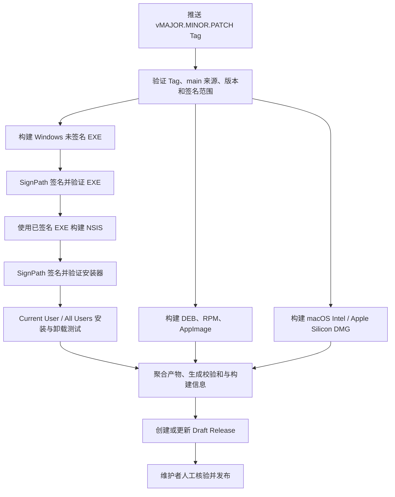

# Release 发布流程

本文档面向花笺维护者，说明 [Release Workflow](../.github/workflows/release.yml) 的配置、触发方式、构建与签名链路、验证规则以及失败后的处理方式。

该 Workflow 负责生成经过验证的多平台发布产物，并创建或更新 GitHub Draft Release。它不会自动把 Draft Release 发布为正式 Release。

## 流程概览

Release Workflow 仅由格式为 `vMAJOR.MINOR.PATCH` 的 Tag Push 触发，例如 `v1.2.3`。



同一个 Tag 的运行通过 Workflow concurrency group 串行化。新运行不会取消正在执行的发布运行。

## 发布权限和外部配置

### GitHub Environment

仓库必须存在名为 `release-signing` 的 GitHub Environment。两个 SignPath Job 都只能通过该 Environment 取得正式签名凭据。

建议为该 Environment 配置：

- Required reviewers，并禁止发起者自审；
- 仅允许受保护的 `v*` Tag 访问；
- 禁止管理员绕过保护规则；
- 正式签名凭据只存放在该 Environment，不放在仓库级 Secrets 中。

### Secrets 和 Variables

`release-signing` Environment 需要提供以下配置：

| 类型     | 名称                                                     | 用途                       |
| -------- | -------------------------------------------------------- | -------------------------- |
| Secret   | `SIGNPATH_RELEASE_API_TOKEN`                             | 提交正式 SignPath 签名请求 |
| Variable | `SIGNPATH_ORGANIZATION_ID`                               | SignPath Organization ID   |
| Variable | `SIGNPATH_PROJECT_SLUG`                                  | SignPath Project Slug      |
| Variable | `SIGNPATH_WINDOWS_BINARY_ARTIFACT_CONFIGURATION_SLUG`    | Windows 主程序签名配置     |
| Variable | `SIGNPATH_WINDOWS_INSTALLER_ARTIFACT_CONFIGURATION_SLUG` | Windows 安装器签名配置     |
| Variable | `SIGNPATH_RELEASE_CERTIFICATE_SUBJECT`                   | 正式证书 Subject 固定值    |
| Variable | `SIGNPATH_RELEASE_CERTIFICATE_ISSUER`                    | 正式证书 Issuer 固定值     |
| Variable | `SIGNPATH_RELEASE_CERTIFICATE_SHA1`                      | 正式证书 SHA-1 指纹        |

Workflow 固定使用 SignPath policy slug `release-signing`，不会从变量动态选择测试策略。

建议在 SignPath 中同时启用：

- Trusted Build System；
- Origin Verification；
- 正式签名人工审批；
- 仓库、Workflow、Tag 和 Commit 来源限制；
- 禁止 rerun 或其他不符合项目发布规则的来源。

### Tag 保护

GitHub 应为 `v*` 配置 Tag ruleset，限制 Tag 的创建、更新、删除和强制推送权限。

Workflow 自身还会在以下时间点读取远端 Tag：

1. 初始发布验证；
2. Windows 主程序签名前；
3. Windows 安装器签名前；
4. 创建或更新 Draft Release 前。

每次检查都要求：

- Tag 仍然存在；
- Tag 仍指向最初触发 Workflow 的 Commit；
- 该 Commit 仍属于远端 `main` 的历史。

只要 Tag 被删除、移动，或 Commit 不再属于 `main`，后续签名或发布就会停止。

## 发布前准备

### 1. 确认代码状态

发布 Commit 必须已经合入 `main`，并通过完整 PR Checks。建议从最新的 `main` Head 发布。

```bash
git switch main
git pull --ff-only origin main
```

### 2. 同步版本号

以下三处版本必须完全一致：

- `package.json` 的 `version`；
- `src-tauri/tauri.conf.json` 的 `version`；
- `src-tauri/Cargo.toml` 的 package `version`。

可以使用项目脚本同步版本：

```bash
npm run version:sync -- 1.2.3
npm install --package-lock-only --ignore-scripts
cargo check --manifest-path src-tauri/Cargo.toml
```

后两条命令用于同步 `package-lock.json` 和 `src-tauri/Cargo.lock`。执行后应检查 `package.json`、`package-lock.json`、Tauri 配置和 Cargo 文件的实际差异。

### 3. 编写 Release Note

为新版本创建：

```text
Docs/release-note/1.2.3.md
```

文件名不包含 `v`。缺少对应 Release Note 时，Workflow 会在构建前失败。

### 4. 执行发布前检查

```bash
cargo test --manifest-path src-tauri/Cargo.toml -p floral-notepaper --lib
npm test
cargo clippy --manifest-path src-tauri/Cargo.toml --all-targets
npm run lint
npm run fmt -- --check
cargo fmt --manifest-path src-tauri/Cargo.toml -- --check
```

全部通过后再合入版本变更。不要用 Release Workflow 替代 PR Checks。

### 5. 创建并推送 Tag

先确认本地 `main` 和远端一致，再在目标 Commit 上创建 annotated Tag：

```bash
git tag -a v1.2.3 -m "release: v1.2.3"
git push origin v1.2.3
```

Tag 名必须严格匹配 `vMAJOR.MINOR.PATCH`。预发布后缀、构建元数据和其他格式不会通过验证。

Tag 推送后不要移动或复用该 Tag。若发现需要修复的问题，应修复代码并发布新的补丁版本，而不是把原 Tag 指向另一个 Commit。

## Workflow Job 说明

| Job                                 | 主要职责                                                                               |
| ----------------------------------- | -------------------------------------------------------------------------------------- |
| `validate-release`                  | 验证 Tag 来源、版本、Release Note、Rust binary target、Tauri bundle 签名范围和安装模式 |
| `build-windows-binary`              | 构建未签名 Windows 主程序，并在签名前写入 Tauri NSIS bundle marker                     |
| `sign-windows-binary`               | 重新验证 Tag，提交正式 SignPath 签名请求，验证签名、时间戳和正式证书固定值             |
| `build-windows-installer`           | 恢复已签名主程序，验证其哈希，构建未签名 NSIS 安装器                                   |
| `sign-and-verify-windows-installer` | 签名安装器，验证 portable EXE 和安装器，执行两种安装模式的安装与卸载测试               |
| `build-linux`                       | 构建并强制收集恰好一个 DEB、RPM 和 AppImage                                            |
| `build-macos-x86_64`                | 构建 Intel DMG                                                                         |
| `build-macos-aarch64`               | 构建 Apple Silicon DMG                                                                 |
| `publish-draft-release`             | 聚合全部产物，生成 `SHA256SUMS.txt` 和 `BUILD-INFO.txt`，创建或更新 Draft Release      |

发布构建统一使用固定的 Rust `1.96.1` 工具链，避免相同 Tag 在不同时间使用不同的 `stable` 编译器。

## Windows 签名和安装验证

### 主程序签名

Windows 主程序在 SignPath 签名前会把 Tauri bundle type marker 从 `UNK` 改为 `NSS`。Workflow 要求：

- `UNK` marker 在修改前恰好出现一次；
- `NSS` marker 在修改前不存在；
- 两个 marker 长度一致；
- 修改后只保留一个 `NSS` marker；
- SignPath 返回的文件必须使用配置的正式证书；
- Authenticode 状态必须为 `Valid`；
- 必须包含时间戳；
- `signtool verify /pa /all /v` 必须通过。

测试证书和不受信任根证书不会被 Release Workflow 接受。

### NSIS 构建

NSIS 打包前，Workflow 会记录已签名主程序的 SHA-256。打包后再次读取 `src-tauri/target/release/floral-notepaper.exe`，确保 bundler 没有替换或修改已签名文件。

### 安装测试

由于 `tauri.conf.json` 声明 `installMode: both`，CI 会依次测试：

- `/S /CurrentUser`；
- `/S /AllUsers`。

每种模式都会验证：

- 安装器和 portable EXE 的正式签名；
- 安装后主程序的正式签名；
- 安装后主程序与 portable EXE 的 SHA-256 一致；
- 安装目录中的实际 PE 文件只包含主程序和已知卸载器；
- 卸载器是合法 PE，并记录 SHA-256；
- 卸载成功后主程序、安装目录和卸载注册表项均已删除。

### 卸载器签名例外

当前 Tauri/NSIS 流程在安装期间生成 `uninstall.exe`。在 SignPath Artifact Configuration 支持该嵌套产物的 deep signing 前，Workflow 明确允许卸载器状态为 `NotSigned`，并把它作为已知发布例外记录到 Job Summary。

如果卸载器带有签名，则该签名必须使用同一正式证书并通过完整验证。任何无效、损坏或其他异常签名状态都会使发布失败。

该例外不表示风险已经消除。正式启用卸载器 deep signing 后，应删除 `NotSigned` 例外并强制要求有效签名。

## 发布产物

Workflow 要求以下七个产物全部存在：

| 平台                | 文件名                                    |
| ------------------- | ----------------------------------------- |
| Windows portable    | `floral-notepaper_VERSION.exe`            |
| Windows NSIS        | `floral-notepaper_VERSION_x64-setup.exe`  |
| Linux DEB           | `floral-notepaper_VERSION_amd64.deb`      |
| Linux RPM           | `floral-notepaper-VERSION-1.x86_64.rpm`   |
| Linux AppImage      | `floral-notepaper_VERSION_amd64.AppImage` |
| macOS Intel         | `floral-notepaper_VERSION_x64.dmg`        |
| macOS Apple Silicon | `floral-notepaper_VERSION_aarch64.dmg`    |

其中 `VERSION` 是不带 `v` 的版本号。

此外还会生成：

- `SHA256SUMS.txt`：全部发布文件的 SHA-256；
- `BUILD-INFO.txt`：Tag、Commit SHA、GitHub Actions Run ID 和 Run Attempt。

## Draft Release 行为

如果 Tag 尚无 GitHub Release，Workflow 会创建 Draft Release；如果已存在同 Tag 的 Draft Release，则更新标题和 Release Note，并使用 `gh release upload --clobber` 覆盖本 Workflow 管理的同名文件。

Workflow 不会：

- 覆盖已经发布的非 Draft Release；
- 删除名称未知的 Release 附件；
- 自动把 Draft 标记为正式发布。

维护者应在 GitHub 页面人工核验：

1. 七个预期平台产物全部存在；
2. `SHA256SUMS.txt` 与实际附件一致；
3. `BUILD-INFO.txt` 中的 Commit 是预期发布 Commit；
4. Windows 文件的 Publisher 和签名状态正确；
5. Release Note 内容及版本正确；
6. 对应 PR Checks 和 Release Workflow 全部成功。

确认无误后再手动发布 Draft Release。

## 失败处理

### Tag 来源验证失败

常见原因：

- Tag 指向尚未合入 `main` 的 Commit；
- Tag 在运行期间被删除或移动；
- 本次运行来自不支持的 Ref；
- Tag 名不是稳定 SemVer 格式。

不要通过移动原 Tag 绕过检查。应修复来源问题，并在需要时使用新的补丁版本。

### 版本或 Release Note 验证失败

检查三处版本号与 `Docs/release-note/VERSION.md`。修复后通过 PR 合入 `main`，再创建新 Tag。

### SignPath 请求失败

依次确认：

- `release-signing` Environment 是否批准；
- `SIGNPATH_RELEASE_API_TOKEN` 是否有效；
- SignPath project 和 artifact configuration slug 是否正确；
- `release-signing` policy 是否允许本仓库、Workflow、Tag 和 Commit；
- Origin Verification 是否给出明确拒绝原因；
- 正式证书固定值是否与 SignPath 实际证书一致。

不要把 Release Workflow 临时改回测试 policy，也不要放宽正式证书验证以使构建通过。

### Linux 或 macOS 产物数量错误

Workflow 要求每种格式恰好一个候选文件。零个候选通常表示 bundler 未生成目标格式；多个候选通常表示输出目录包含旧文件或 Tauri 输出结构发生变化。

应修正构建或收集逻辑，不要改成任意选择第一个文件。

### Windows 安装测试失败

根据失败阶段检查：

- portable EXE 与安装后文件的 SHA-256；
- Authenticode 和时间戳状态；
- Current User 与 All Users 对应的卸载注册表位置；
- 安装目录中的额外 PE 文件；
- 卸载后的目录、文件和注册表残留；
- NSIS hook 或 Tauri installer 行为是否发生变化。

### 重试原则

同 Tag 的运行不会并发执行。只有在确认 Tag 没有移动、代码和配置没有变化，且失败属于临时基础设施问题时，才适合重新运行失败 Job。

若修复需要修改仓库内容，应通过新 Commit 和新版本 Tag 发布，不应让同一 Tag 对应不同源码或不同 Workflow。

## 维护要求

修改以下内容时，应同步更新本文档：

- `.github/workflows/release.yml` 的触发条件、Job 或权限；
- SignPath policy、artifact configuration、证书或变量命名；
- Tauri bundle target 或 Windows `installMode`；
- 发布产物名称、平台或架构；
- Draft Release 创建、覆盖或校验清单行为；
- Rust 发布工具链版本；
- 卸载器签名例外。

对 Release Workflow 的变更应经过安全审查，并由 CODEOWNERS 保护 Workflow 和 SignPath policy 文件。
