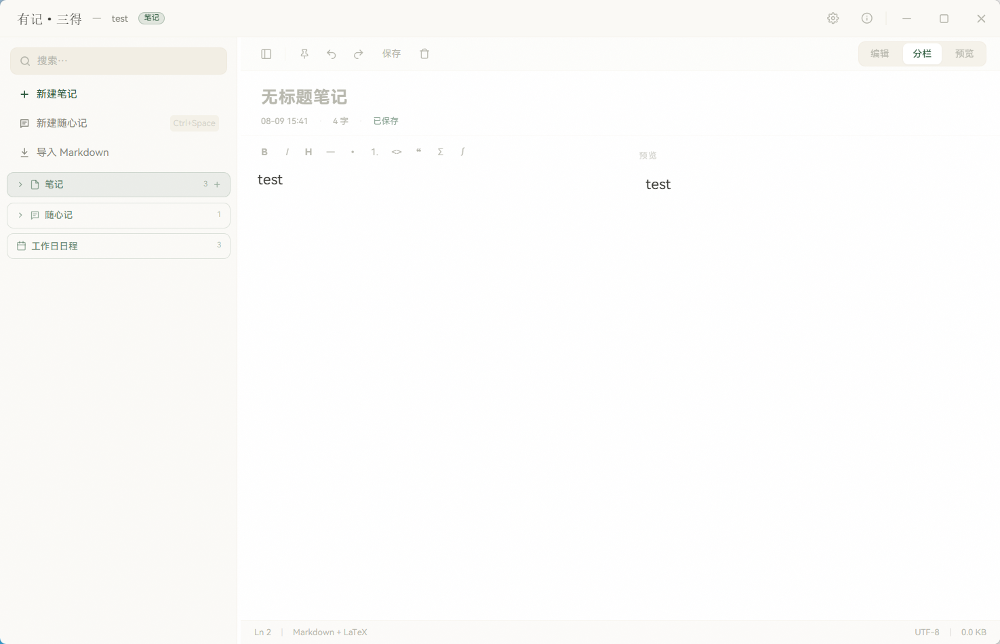

# 有记·三得

> 有所思，有所记，三份所得。

采用videcoding的方式，基于 [花笺 (Floral Notepaper)](https://github.com/Achilng/floral-notepaper) 二次开发的个人效率工具，在原始笔记功能之上新增了**随心记**和**日历日程**两大模块。

---

## ✨ 功能

### 📋 笔记
- 完整的 Markdown 编辑与预览，支持 GFM 语法和 LaTeX 公式
- 文件夹分类管理，拖拽移动
- 导入/导出 `.md` 文件

### 💬 随心记
- 全局快捷键呼出小窗（默认 `Ctrl+Space`），闪现即记
- 独立管理，不干扰主笔记列表
- 支持一键钉为桌面磁贴

### 📅 日程
- 日历视图，点击日期即可创建当天日程
- 自动生成任务清单 + 晚间总结模板
- 年月快速跳转，有内容的日期高亮标记

### 🎨 体验
- 浅色 / 深色 / 跟随系统三种主题
- 自定义字体大小、磁贴颜色
- 开机自启、关闭到托盘
- 励志语句自定义（仅在日程编辑时显示）

---

## 🛠 技术栈

| 层级 | 技术 |
|------|------|
| 桌面框架 | Tauri 2 |
| 前端 | React 19 + TypeScript + Vite |
| 样式 | Tailwind CSS 4 |
| 后端 | Rust |
| 国际化 | i18next |

---

## 📥 安装

### Windows

从 [Releases](https://github.com/Achilng/floral-notepaper/releases) 下载：

- `floral-notepaper_x.x.x_x64-setup.exe` — 安装版
- `floral-notepaper_x.x.x.exe` — 便携版（无需安装）

双击运行即可。需要 Windows 10 1809+ 或 Windows 11。

### 从源码构建

```bash
# 前置要求
# Node.js 20.19+ / 22.12+
# Rust 工具链

npm install
npm run tauri build
```

构建产物在 `src-tauri/target/release/bundle/` 下。

---

## 📂 数据目录

所有笔记数据存储在 `文档\花笺\` 下：

```
花笺/
├── metadata.json     # 笔记索引
├── config.json       # 用户配置（位于 %APPDATA%\floral-notepaper\）
├── notes/            # 笔记 .md 文件（按分类分目录）
├── images/           # 笔记内嵌图片
└── backgrounds/      # 自定义背景图
```

---

## 🙏 致谢

本项目基于 [花笺 (Floral Notepaper)](https://github.com/Achilng/floral-notepaper) 二次开发，感谢原作者的优雅设计和开源精神。

在原作基础上增加了：
- 随心记（独立管理的便签模块）
- 日历日程（按日期组织的任务清单）
- 分类选择器（新建笔记时选择目标目录）
- 编辑区空态背景板
- 可自定义的励志语句

原始花笺项目使用 MIT 协议开源，本项目遵循相同协议。

---

## 📄 协议

[MIT](LICENSE)
